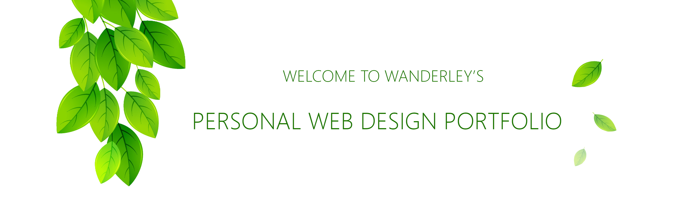

Welcome to Wanderley's Web Design Portfolio!
===================

Hi there! It is a pleasure to have your visit here in my **Porfolio**. Comments and freelance jobs are more than welcome. If you are interested please drop a message for juniormayhe [at] gmail.com. If you want a safer platform, you can hire me by visiting the [Freelancer site](https://www.freelancer.es/u/juniormayhe.html).

## Icons

Hereunder are some icons created in Photoshop

|  |  |  | 
| :---: | :---: | :---:  | :---: |
|  |  |  | 
|  |  |  | 
|  |  |  | 
|  |  |  | 
|  |  |  | 
|  |  |  | 
|  |  |  | 
|  |  |  | 
|  |  |  | 
|  |  |  | 
|  |  |  | 
|  |  |  | 
|  |  |  | 
|  |  |  | 
|  |  |   |

## Illustrations

Here you'll find some illustrations that I had created.

|  |  |
| :---: | :---: |
|  |  |
|  |  |
|  |  |
|  |  |
|  |  |
|  |  |

## Logos

Here you'll find some logos that I had created.

|  |   |
| :---: | :---: |
|  |  |
|  |  |
|  |  |
|  |  |
|  |  |

## Mockups 

Here you'll find some mock-ups / prototypes of systems that I had developed.

### Rightjob app

Right Job is a mobile application that allows to search jobs from many countries in one place, in a practical and intuitive way. Core technologies used in this project are Android Studio, Android SDK, Java, XML.

|  |  |
| :---: | :---: |
|  |  |
|  |  |
|  |  |

### Rodocred Portal

The Rodocred Portal is a website that offers logistics solutions to shippers, carriers and truck drivers such as control of shipping, travel and cargo transportation tracking, documents screening, fleet supply control via POS (Point of Sale) and electronic toll purchase in accredited network available throughout Brazil. Main technologies used in this project are: .NET 4, WCF (Web services), C #, XML, Entity Framework, HTML, CSS, Team Foundation Server (TFS), Enterprise Architect, SQL Server, Point of Sale Verifone Nurit 8400 and VX540.

#### :art: details-of-fuel-handling

#### :art: rodocred-fuel-supplies-report

#### :art: rodocred-fuel-supply-dispute-request

#### :art: rodocred-handling-of-fuels-in-tanks2

#### :art: rodocred-private-fuel-station-settings

#### :art: rodocred-fleet-fuel-supply-history

#### :art: rodocred-fuel-supply-dispute-list

#### :art: rodocred-handling-of-fuels-in-tanks

#### :art: rodocred-loss-of-fuel-report

---

### Food and Beverage

The goal of this project was to allow BigBola Casinos to replace the legacy Food and Beverage software with a new one, as the renewal contract was too expensive and the old version could not meet the new requirements. A new version was developed and deployed in 12 cities in Mexico, in all restaurants, offering modules for each user role, such as restaurant manager, warehouse manager, chef, waiters and cashier. The software also provides tracking of cash and invoice printing for customers based on their consumption. The technologies used were Blend, XAML, WPF, C #, NET 3.5, WCF, SQL Server.

#### :art: bigbola-food-and-beverage-home-window

#### :art: bigbola-food-and-beverage-login

#### :art: bigbola-food-and-beverage-tables-map

#### :art: bigbola-food-and-beverage-choose-items-for-order

#### :art: bigbola-food-and-beverage-register-order

#### :art: bigbola-food-and-beverage-transfer-tables-between-waiters

#### :art: bigbola-food-and-beverage-chefs-view

#### :art: bigbola-virtual-bingo

---

### Exame reviewer

MVC 5 concept application where is being used Microsoft Practices Unity, Microsoft Extensions Logging, Security, Entity Framework, Exams Image generation, XPagedList pagination, among others.

#### :art: login

#### :art: list-of-questions

#### :art: edit-question

#### :art: answer-simulator

#### :art: list-of-answers

#### :art: evaluate-answer

#### :art: access-denied

#### :art: internal-server-error

#### :art: page-note-found

#### :art: invalid-request

---

### Taxi self service desk

MVC 5 application for showing statuses of taxi requests.

#### :art: pending taxi requests

#### :art: confirmed, cancelled requests and unavailable taxis

## License

